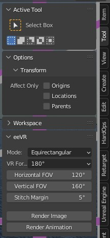
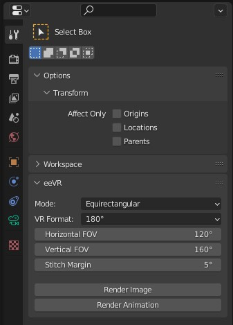
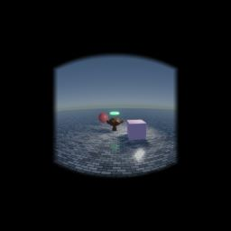
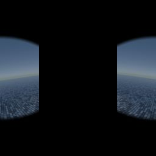
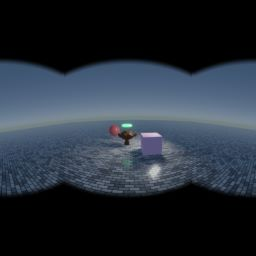
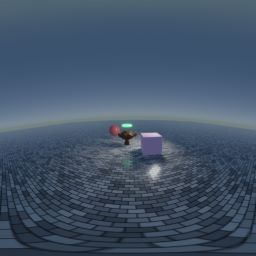

# eeVR

Blender addon to render 360° and 180° images and videos in eevee engine with support for stereoscopic rendering.

## Getting Started

You will need to get [**Blender 3.x**](https://www.blender.org), install it, download the zip file from this GitHub, load the addon into Blender by installing the zip file in Blender Preferences > Add-ons > Install, search for "eeVR" under the Community tab and click the checkbox to enable it. A tool panel will appear in the 3D Viewport's **Tool tab**, FOV value adjustment, and buttons for rendering stills and animations. **The rendered images/image sequences will be stored in the same directory as the .blend file**.

 

### Stitch Margin

An angle for seam blending.

Stitch Margin = 5°

 +  = 

Final Image

## License

This project is licensed under the GNU General Public License v3.0 - see the [LICENSE.md](LICENSE.md) file for details.

## Acknowledgments

- The image conversion OpenGL shader was originally created by [Xyene](https://github.com/Xyene) and modified for use in Blender so thank you.

### Original Founder

[EternalTrail](https://github.com/EternalTrail)
